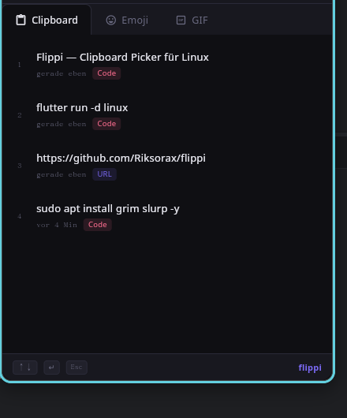

# Flippi

A system-wide clipboard history, emoji, and GIF picker for Linux Wayland — built with Flutter Desktop.

[](https://github.com/sponsors/Riksorax)



---

## Features

- **Clipboard History** — automatically captures everything you copy, with type detection (Text, URL, Code)
- **Emoji Picker** — Unicode emojis, Material Icons, and custom emojis you define yourself
- **GIF Search** — search and copy GIFs via the Giphy API
- **Popup window** — appears on demand, hides when focus is lost, no taskbar entry
- **Persistent** — clipboard history and custom emojis survive restarts (stored locally via Hive)
- **Wayland-native** — built for modern Linux desktops

---

## Requirements

- Linux with a Wayland compositor
- [`wl-clipboard`](https://github.com/bugaevc/wl-clipboard) for clipboard monitoring:
  ```bash
  sudo apt install wl-clipboard
  ```
- [`keybinder-3.0`](https://github.com/kupferlauncher/keybinder) for the hotkey manager:
  ```bash
  sudo apt install libkeybinder-3.0-dev
  ```

---

## Installation

### From source

```bash
git clone https://github.com/Riksorax/flippi.git
cd flippi
flutter pub get
flutter build linux --release
```

The binary is at `build/linux/x64/release/bundle/flippi`.

Optionally create a symlink:

```bash
sudo ln -s "$(pwd)/build/linux/x64/release/bundle/flippi" /usr/local/bin/flippi
```

### Flatpak (local)

```bash
flatpak-builder --force-clean --user build-dir flatpak/io.github.frankspeu.flippi.yml
flatpak-builder --run build-dir flatpak/io.github.frankspeu.flippi.yml flippi
```

---

## Setup

### Autostart

Flippi is designed to run in the background and be called repeatedly. Add it to your session autostart so it's always available:

- **COSMIC:** Settings → Startup Applications → Add → `flippi`
- **GNOME:** `gnome-session-properties` or place a `.desktop` file in `~/.config/autostart/`

### Global Shortcut (Super + .)

Since Wayland prevents apps from registering global hotkeys directly, set up a custom keyboard shortcut that calls `flippi`:

- **COSMIC:** Settings → Keyboard → Custom Shortcuts → Add
  - Name: `Flippi`
  - Command: `/usr/local/bin/flippi`
  - Shortcut: `Super + .`

When called, Flippi toggles: if it's hidden it shows the window; if it's visible it hides it. If no instance is running it starts one.

---

## Usage

1. Press **Super + .** to open Flippi
2. Click any clipboard entry to copy it — then paste with **Ctrl+V** in your target app
3. Switch tabs to browse **Emojis** or search **GIFs**
4. Press **Esc** or click outside the window to dismiss

> **Note:** Wayland does not allow apps to paste directly into other windows. Flippi copies the selected item to your clipboard; you paste manually with Ctrl+V.

---

## Known Limitations

- **No auto-paste:** Wayland security prevents simulating keystrokes in other apps — always paste with Ctrl+V after selecting an item
- **Global hotkey:** `keybinder-3.0` may not work on pure Wayland compositors. Using a system-level shortcut (as described above) is the recommended approach
- **Flatpak sandbox:** The Giphy API key is compiled into the binary. For production use, consider externalising it

---

## Project Structure

```
lib/
├── core/
│   ├── clipboard/     # ClipboardNotifier, Hive persistence, wl-paste watcher
│   ├── gif/           # GifNotifier, Giphy API
│   └── hotkey/        # HotkeyService (keybinder)
├── features/
│   ├── clipboard/     # Clipboard tab UI
│   ├── emoji/         # Emoji + Material Icons + Custom Emojis UI
│   └── gif/           # GIF search UI
└── shared/
    ├── theme/         # AppTheme, FlippiColors
    └── widgets/       # FlippiShell, TabContent
```

---

## Tech Stack

| | |
|---|---|
| UI | Flutter Linux Desktop |
| State | Riverpod 3 (`NotifierProvider`) |
| Storage | Hive (no code generation) |
| Window | window_manager |
| GIFs | Giphy API via `http` |

---

## License

MIT
